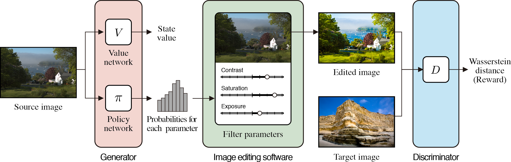
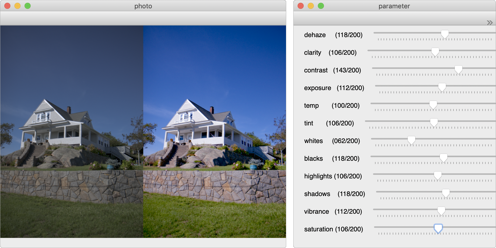

# Unpaired Image Enhancement Featuring Reinforcement-Learning-Controlled Image Editing Software
This is the official implementation of the [paper](https://arxiv.org/abs/1912.07833.pdf) in AAAI2020.
We provide the sample codes for training and testing and pretrained models on photo enhancement.

<p align="left">

</p>

## Requirements
- Python 3.6
- Chainer 7.0
- ChainerRL 0.6
- pyyaml
- matplotlib
- opencv-python
- numpy

## Installation
1. Clone the repository.
  ```Shell
  # Make sure to clone with --recursive
  git clone --recursive git@github.com:satoshi-kosugi/Unpaired-Image-Enhancement.git
  ```
  
 2. Download [MIT-Adobe FiveK Dataset](https://data.csail.mit.edu/graphics/fivek/).
  We used Adobe Lightroom to decode the images to TIF format and resize the long side of the images to 512 px.
  Put original images and images retouched by Expert C in `$ROOT/fivek_dataset/original/` and `$ROOT/fivek_dataset/expertC/`, respectively.
  
## Training and testing
1. Train the framework.
```Shell
python train.py settings/photo_enhancement.yaml logs
```
2. Test the framework.
```Shell
python test.py settings/photo_enhancement.yaml logs --result_dir logs/20200115T223451.986831/96000_finish/test_results --load logs/20200115T223451.986831/96000_finish/
```
3. If you want to try the framework, you can use the demo code and the trained model.
```Shell
python demo.py settings/photo_enhancement.yaml --load_generator generator_weights_for_demo.npz --file_name $image_name
```
&nbsp; &nbsp; &nbsp;  The following windows will be displayed.
<p align="left">

</p>

## Reference
Our implementation is based on [chainer_spiral](https://github.com/DwangoMediaVillage/chainer_spiral). We would like to thank them.

## Citation
If you find our research useful in your research, please consider citing:

    @inproceedings{kosugi2020unpaired,
        title={Unpaired Image Enhancement Featuring Reinforcement-Learning-Controlled Image Editing Software},
        author={Kosugi, Satoshi and Yamasaki, Toshihiko},
        booktitle = {AAAI},
        year = {2020}
    }
